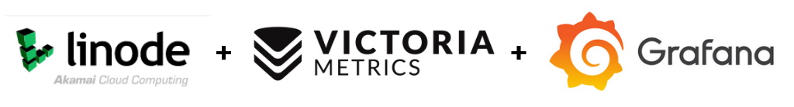
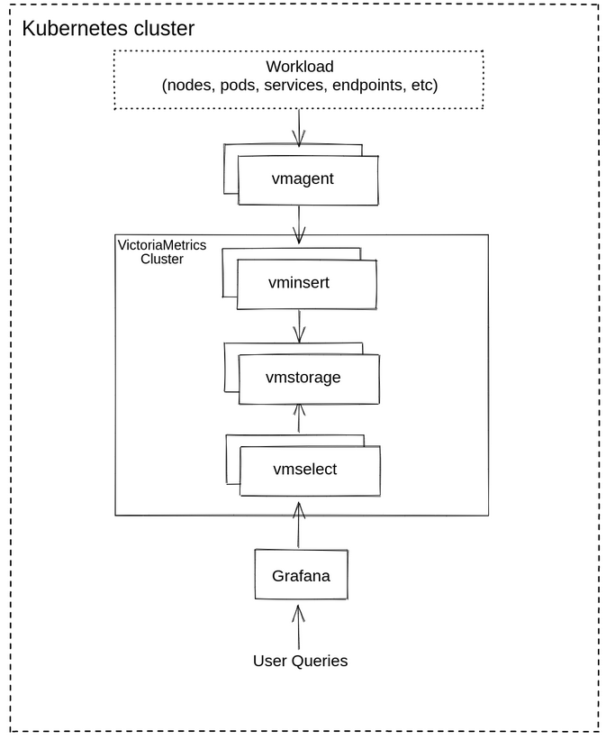
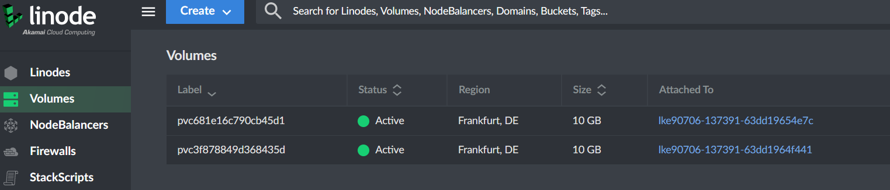
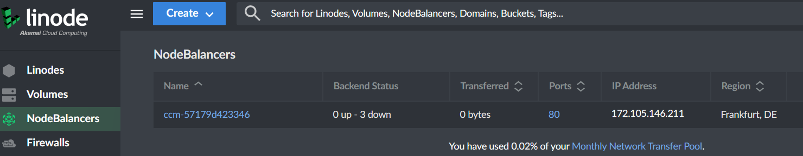
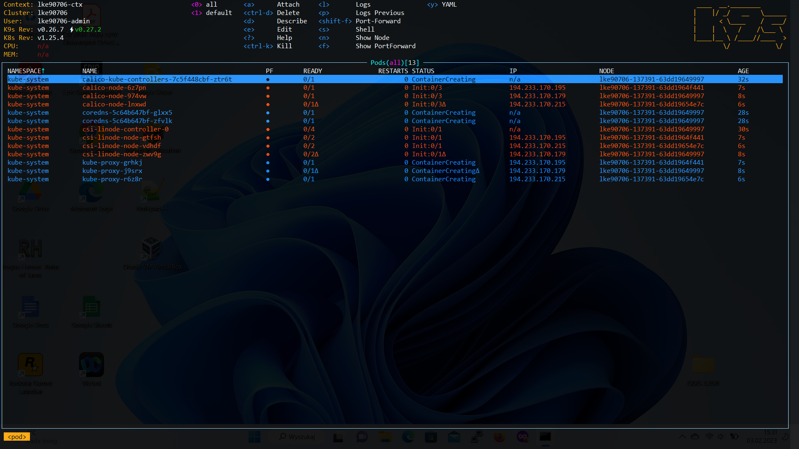
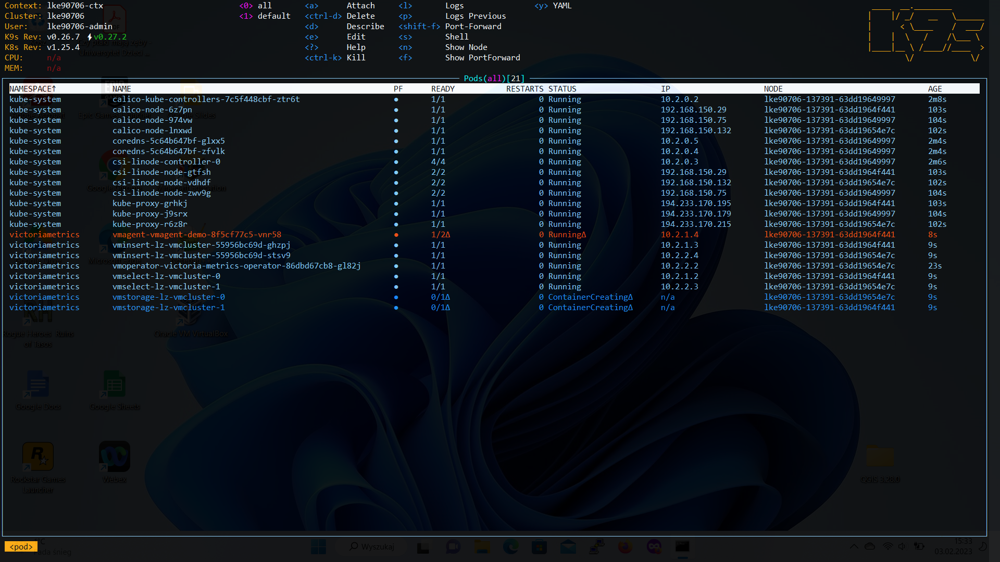
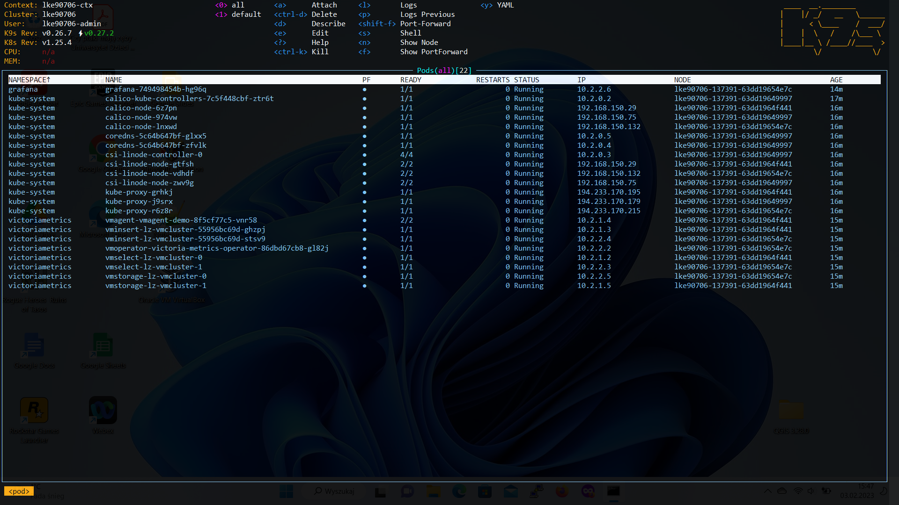
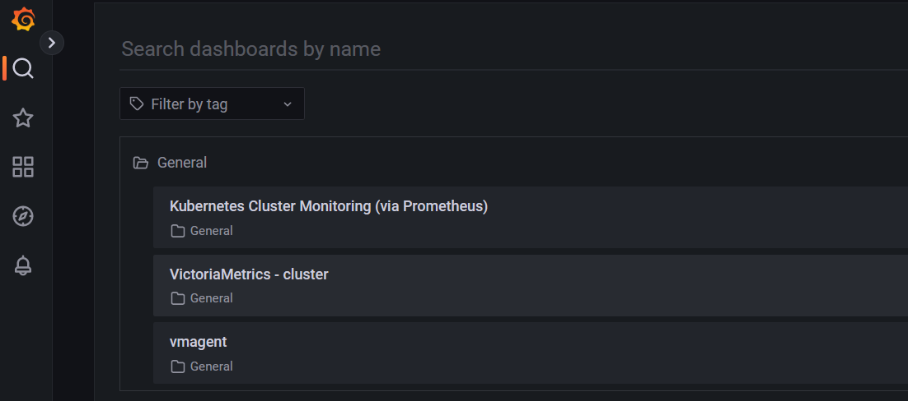
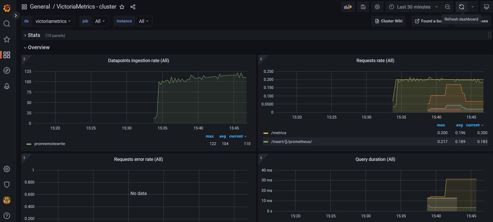

# LinodeVMG

  

Simple script which demonstrates Victoriametrics + Grafana
setup on LKE Linode K8s Env - Cloud Computing platform.  

---

## Description
This project covers automation of:
- setup of LKE ([Linode Kubernetes Engine](https://www.linode.com/products/kubernetes/))
- K8s 'self' monitoring with [VictoriaMetrics Cluster](https://docs.victoriametrics.com/Cluster-VictoriaMetrics.html)
- setup of [Gafana](https://grafana.com/) for visualization of stored data

Logical architecture of components was presented in below diagram:  

  

[vmagent](https://docs.victoriametrics.com/vmagent.html) - is a tiny agent which helps collect metrics
from various sources but for the purpose of this project `vmagent` collects only "internal/node" K8s metrics.  

**NOTE:** demo of integration with other data sources for further consideration  

VM Components / Services:  
- `vminsert` - accepts the ingested data and spreads it among vmstorage nodes according to consistent hashing over metric name and all its labels
- `vmstorage` - stores the raw data and returns the queried data on the given time range for the given label filters
- `vmselect` - performs incoming queries by fetching the needed data from all the configured vmstorage nodes
For more details please visit [doc](https://docs.victoriametrics.com/Cluster-VictoriaMetrics.html)

More useful guides available [here](https://docs.victoriametrics.com/guides/).


## TL;DR - How to run project
### Environment  
- LKE Kubernetes cluster 1.25
- [git](https://git-scm.com/book/en/v2/Getting-Started-Installing-Git)
- [kubectl 1.26](https://kubernetes.io/docs/tasks/tools/install-kubectl)
- [Helm 3](https://helm.sh/docs/intro/install/)
- [python3](https://www.python.org/downloads/)
- ( optinaly but recomended :) )  [K9s](https://k9scli.io/topics/install/)

### Project Repo
1. First, clone github repo and install require python modules
``` bash
git clone https://github.com/lzalewsk/LinodeVMG.git
cd LinodeVMG
pip install -r requirements.txt
```

### Create full stack K8s + VM + Grafana
2. Edit `config.ini` and fill in valid Linode token.
```
[LINODE]
TOKEN = <linode_token>
[...]
```  
**NOTE:** Rest of fields was provided as example. It could be change base on any further needs.  

3. Run `python lke_vmg.py -c` and watch logs :)  
   Grafana access IP and password for admin shall be printed after few minutes.
``` commandline
################################################################################
#------------------------------------------------------------------------------#
#   Grafana shall be availablu on http://<public_service_IP>
#   Password for user admin is: <password>
#------------------------------------------------------------------------------#
################################################################################
```


### Cleaning up
4. Run `python lke_vmg.py -d` and check resources in [Linode Cloud](https://cloud.linode.com/volumes)


## Main files
The project template includes following files:
 
```  
└--grafana                      # Grafana YAMLs
|   |               
│   └ grafana_helm_values.yaml  # HELM values config file of Grafana                     
└--vmetrics                     # VictoraMetrics YAMLs
|   |               
│   └ vmagent.yaml              # config file of VMagent                      
│   └ vmcluster.yaml            # config file of VMCluster
│   └ vmoperator.yaml           # HELM values config file of VictoriaMetrics operator 
└ config.ini                    # main configuration file
└ lke_vmg.py                    # main script
└ requirements.txt              # list of python modules require for run this demo
└ README.md
└ .gitignore
```

## YAML Config aspects in relation to LKE  

1. Assuming that LKE cluster is available next step is deployment of
VictoriaMetrics operator. [HELM chart of VMOperator](https://github.com/VictoriaMetrics/helm-charts/tree/master/charts/victoria-metrics-operator) is used.  
For K8s version > 1.24 PSP shall be disabled in `./vmetrics/vmoperator.yaml`
```yaml
...
rbac:
  create: true
  pspEnabled: false # disable for K8s > v1.24
...
```

2. Next, to deploy vmcluster please note that proper storageClassName is used  
   `./vmetrics/vmcluster.yaml`

```yaml
...
    storage:
      volumeClaimTemplate:
        spec:
          accessModes:
            - ReadWriteOnce
          resources:
            requests:
              storage: 10G
#          storageClassName: linode-block-storage-retain
          storageClassName: linode-block-storage
...
```  
During deployment process additional Linode Volumes shall be created. 
  

**NOTE:** `linode-block-storage-retain` case that Volume shall be still
available even after deletion of PVC in K8s

3. Assuming that `vmcluster` is ready, `vmagent` shall know where metric data shall be send
Please chceck URL in `remoteWrite` section of `./vmetrics/vmagent.yaml`  

```yaml
...
spec:
...
  remoteWrite:
    - url: "http://vminsert-lz-vmcluster.victoriametrics.svc.cluster.local:8480/insert/0/prometheus/api/v1/write"
```

**NOTE:** Pleas check and compare namespace `victoriametrics` and 
in this demo case in `./vmetrics/vmcluster.yaml` configuration  

```yaml
apiVersion: operator.victoriametrics.com/v1beta1
kind: VMCluster
metadata:
  name: lz-vmcluster
```

4. Grafana Dashboard - please takea look at datasource ulr configuration.
It shall be refare to proper `vmcluster` name and namespace.
Additionaly proper configuration of storageClassName is needed in  
`./grafana/grafana_helm_values.yaml`
```yaml
...
datasources:
  datasources.yaml:
    apiVersion: 1
    datasources:
...
        url: http://vmselect-lz-vmcluster.victoriametrics.svc.cluster.local:8481/select/0/prometheus/
...
persistence:
  type: pvc
  enabled: true
  storageClassName: linode-block-storage
...
```

For the purpose of this demo Grafana is exposed with public IP, therefore Load Balancer is used.
More options of IP and NodeBalancers - please visit this [link](https://www.linode.com/content/load-balancing-on-an-lke-kubernetes-cluster/)
Service conf in `./grafana/grafana_helm_values.yaml`:
```yaml
...
service:
  type: LoadBalancer
...
```  

and result in  Linode Cloud console  


## K9s and deployment process

If [K9s](https://k9scli.io/topics/install/) is available, during deployment process
after the LKE/K8s is ready and `get LKE kubeconfig` is done, you can use K9s tool,
where process of deployment of rest of pods of VM and Grafana can be monitored.  

A few screenshots below:  
1. K8s cluster initialization  
  
2. VMCluester initialization  

3. VM + Grafana ready  



## Grafana Dashboards

After deployment of full stack of VM and Grafana following dashboards shall be available:

  
and one of example:  



## License
[MIT](https://choosealicense.com/licenses/mit/)